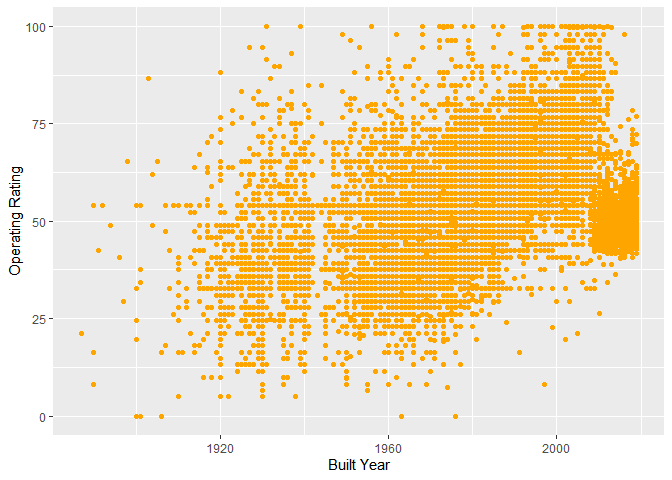
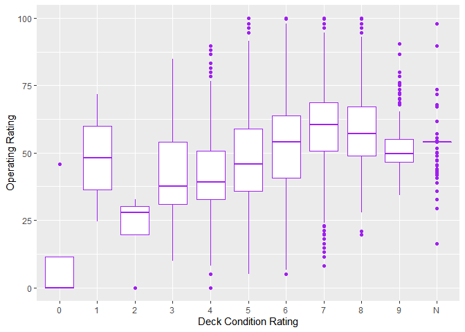

HW\_week2
================
SHUYUAN JIA
9/22/2021

## GitHub URL

*<https://github.com/Shuyuan301/STAT433_Fall2021.git>*

## Download Bridge Dataset in WI

**Firstly, I use Microsoft Excel to convert a txt file to an excel
file.**

``` r
library("readxl")
my_data <- read_excel("WI20.xlsx")
head(my_data)
```

    ## # A tibble: 6 x 123
    ##   STATE_CODE_001 STRUCTURE_NUMBER_008 RECORD_TYPE_005A ROUTE_PREFIX_005B
    ##            <dbl> <chr>                           <dbl>             <dbl>
    ## 1             55 00000000000F303                     1                 6
    ## 2             55 00000000000F304                     1                 6
    ## 3             55 00000000000F310                     1                 6
    ## 4             55 00000000000F311                     1                 6
    ## 5             55 00000000000F315                     1                 6
    ## 6             55 00000000000F317                     1                 6
    ## # ... with 119 more variables: SERVICE_LEVEL_005C <dbl>,
    ## #   ROUTE_NUMBER_005D <chr>, DIRECTION_005E <dbl>, HIGHWAY_DISTRICT_002 <chr>,
    ## #   COUNTY_CODE_003 <dbl>, PLACE_CODE_004 <dbl>, FEATURES_DESC_006A <chr>,
    ## #   CRITICAL_FACILITY_006B <lgl>, FACILITY_CARRIED_007 <chr>,
    ## #   LOCATION_009 <chr>, MIN_VERT_CLR_010 <dbl>, KILOPOINT_011 <dbl>,
    ## #   BASE_HWY_NETWORK_012 <dbl>, LRS_INV_ROUTE_013A <chr>,
    ## #   SUBROUTE_NO_013B <dbl>, LAT_016 <dbl>, LONG_017 <dbl>, ...

``` r
colnames(my_data) #check column names and pick the variables I'd like to use
```

    ##   [1] "STATE_CODE_001"          "STRUCTURE_NUMBER_008"   
    ##   [3] "RECORD_TYPE_005A"        "ROUTE_PREFIX_005B"      
    ##   [5] "SERVICE_LEVEL_005C"      "ROUTE_NUMBER_005D"      
    ##   [7] "DIRECTION_005E"          "HIGHWAY_DISTRICT_002"   
    ##   [9] "COUNTY_CODE_003"         "PLACE_CODE_004"         
    ##  [11] "FEATURES_DESC_006A"      "CRITICAL_FACILITY_006B" 
    ##  [13] "FACILITY_CARRIED_007"    "LOCATION_009"           
    ##  [15] "MIN_VERT_CLR_010"        "KILOPOINT_011"          
    ##  [17] "BASE_HWY_NETWORK_012"    "LRS_INV_ROUTE_013A"     
    ##  [19] "SUBROUTE_NO_013B"        "LAT_016"                
    ##  [21] "LONG_017"                "DETOUR_KILOS_019"       
    ##  [23] "TOLL_020"                "MAINTENANCE_021"        
    ##  [25] "OWNER_022"               "FUNCTIONAL_CLASS_026"   
    ##  [27] "YEAR_BUILT_027"          "TRAFFIC_LANES_ON_028A"  
    ##  [29] "TRAFFIC_LANES_UND_028B"  "ADT_029"                
    ##  [31] "YEAR_ADT_030"            "DESIGN_LOAD_031"        
    ##  [33] "APPR_WIDTH_MT_032"       "MEDIAN_CODE_033"        
    ##  [35] "DEGREES_SKEW_034"        "STRUCTURE_FLARED_035"   
    ##  [37] "RAILINGS_036A"           "TRANSITIONS_036B"       
    ##  [39] "APPR_RAIL_036C"          "APPR_RAIL_END_036D"     
    ##  [41] "HISTORY_037"             "NAVIGATION_038"         
    ##  [43] "NAV_VERT_CLR_MT_039"     "NAV_HORR_CLR_MT_040"    
    ##  [45] "OPEN_CLOSED_POSTED_041"  "SERVICE_ON_042A"        
    ##  [47] "SERVICE_UND_042B"        "STRUCTURE_KIND_043A"    
    ##  [49] "STRUCTURE_TYPE_043B"     "APPR_KIND_044A"         
    ##  [51] "APPR_TYPE_044B"          "MAIN_UNIT_SPANS_045"    
    ##  [53] "APPR_SPANS_046"          "HORR_CLR_MT_047"        
    ##  [55] "MAX_SPAN_LEN_MT_048"     "STRUCTURE_LEN_MT_049"   
    ##  [57] "LEFT_CURB_MT_050A"       "RIGHT_CURB_MT_050B"     
    ##  [59] "ROADWAY_WIDTH_MT_051"    "DECK_WIDTH_MT_052"      
    ##  [61] "VERT_CLR_OVER_MT_053"    "VERT_CLR_UND_REF_054A"  
    ##  [63] "VERT_CLR_UND_054B"       "LAT_UND_REF_055A"       
    ##  [65] "LAT_UND_MT_055B"         "LEFT_LAT_UND_MT_056"    
    ##  [67] "DECK_COND_058"           "SUPERSTRUCTURE_COND_059"
    ##  [69] "SUBSTRUCTURE_COND_060"   "CHANNEL_COND_061"       
    ##  [71] "CULVERT_COND_062"        "OPR_RATING_METH_063"    
    ##  [73] "OPERATING_RATING_064"    "INV_RATING_METH_065"    
    ##  [75] "INVENTORY_RATING_066"    "STRUCTURAL_EVAL_067"    
    ##  [77] "DECK_GEOMETRY_EVAL_068"  "UNDCLRENCE_EVAL_069"    
    ##  [79] "POSTING_EVAL_070"        "WATERWAY_EVAL_071"      
    ##  [81] "APPR_ROAD_EVAL_072"      "WORK_PROPOSED_075A"     
    ##  [83] "WORK_DONE_BY_075B"       "IMP_LEN_MT_076"         
    ##  [85] "DATE_OF_INSPECT_090"     "INSPECT_FREQ_MONTHS_091"
    ##  [87] "FRACTURE_092A"           "UNDWATER_LOOK_SEE_092B" 
    ##  [89] "SPEC_INSPECT_092C"       "FRACTURE_LAST_DATE_093A"
    ##  [91] "UNDWATER_LAST_DATE_093B" "SPEC_LAST_DATE_093C"    
    ##  [93] "BRIDGE_IMP_COST_094"     "ROADWAY_IMP_COST_095"   
    ##  [95] "TOTAL_IMP_COST_096"      "YEAR_OF_IMP_097"        
    ##  [97] "OTHER_STATE_CODE_098A"   "OTHER_STATE_PCNT_098B"  
    ##  [99] "OTHR_STATE_STRUC_NO_099" "STRAHNET_HIGHWAY_100"   
    ## [101] "PARALLEL_STRUCTURE_101"  "TRAFFIC_DIRECTION_102"  
    ## [103] "TEMP_STRUCTURE_103"      "HIGHWAY_SYSTEM_104"     
    ## [105] "FEDERAL_LANDS_105"       "YEAR_RECONSTRUCTED_106" 
    ## [107] "DECK_STRUCTURE_TYPE_107" "SURFACE_TYPE_108A"      
    ## [109] "MEMBRANE_TYPE_108B"      "DECK_PROTECTION_108C"   
    ## [111] "PERCENT_ADT_TRUCK_109"   "NATIONAL_NETWORK_110"   
    ## [113] "PIER_PROTECTION_111"     "BRIDGE_LEN_IND_112"     
    ## [115] "SCOUR_CRITICAL_113"      "FUTURE_ADT_114"         
    ## [117] "YEAR_OF_FUTURE_ADT_115"  "MIN_NAV_CLR_MT_116"     
    ## [119] "FED_AGENCY"              "SUBMITTED_BY"           
    ## [121] "BRIDGE_CONDITION"        "LOWEST_RATING"          
    ## [123] "DECK_AREA"

## Making a CSV File

**Then, I made a csv file with Bridge ID, Built Year, County Code, Deck
Condition Rating, Superstructure Condition Rating, Substructure
Condition Rating, and Operating Rating.**

``` r
df <- data.frame (col_1 = my_data['STRUCTURE_NUMBER_008'],
                  col_2 = my_data['YEAR_BUILT_027'],
                  col_3 = my_data['COUNTY_CODE_003'],
                  col_4 = my_data['DECK_COND_058'],
                  col_5 = my_data['SUPERSTRUCTURE_COND_059'],
                  col_6 = my_data['SUBSTRUCTURE_COND_060'],
                  col_7 = my_data['OPERATING_RATING_064'])

colnames(df) <- c('Bridge_ID','Built_Year','County_Code','Deck_Cond',
                  'Superstructure_Cond','Substructure_Cond','Operating_Rating')

write.csv(df,'WI_Bridge_data.csv')
```

``` r
data = read.csv('WI_Bridge_data.csv')
head(data)
```

    ##   X       Bridge_ID Built_Year County_Code Deck_Cond Superstructure_Cond
    ## 1 1 00000000000F303       1932          51         4                   5
    ## 2 2 00000000000F304       1974          51         5                   5
    ## 3 3 00000000000F310       1948         115         5                   5
    ## 4 4 00000000000F311       1979         115         5                   7
    ## 5 5 00000000000F315       1977           3         5                   5
    ## 6 6 00000000000F317       1980           3         7                   8
    ##   Substructure_Cond Operating_Rating
    ## 1                 5             24.7
    ## 2                 4              7.3
    ## 3                 7             21.6
    ## 4                 8             31.5
    ## 5                 7             40.6
    ## 6                 7             47.7

## Plotting

**I would like to figure out if there is any relationship between built
year and operating rating.**

Plot by using ggplot:

``` r
library(ggplot2)
ggplot(data, aes(x=Built_Year, y=Operating_Rating)) + geom_point(color='orange')+
  labs(x = "Built Year",y = "Operating Rating")
```

<!-- -->

**From the above plot, we can see that it seems the later the bridge is
built, the higher the operating rating is.**

**Also, I would like to check if there is any relationship between Deck
condition rating and operating rating**

``` r
library(ggplot2)
ggplot(data, aes( x=Deck_Cond, y=Operating_Rating)) + geom_boxplot(color='purple')+
  labs(x = "Deck Condition Rating",y = "Operating Rating")
```

<!-- -->

**From this plot, we can see that the bridges with deck condition rating
larger than 6 got better median operating ratings than the bridges with
deck condition rating below or equal to 5.**

**Try to build a basic model to predict the operating rating by using
condition ratings**

``` r
data$Superstructure_Cond <- as.numeric(data$Superstructure_Cond)
data$Substructure_Cond <- as.numeric(data$Substructure_Cond)

mymodel = lm(Operating_Rating ~ Superstructure_Cond + Substructure_Cond, data = data)
summary(mymodel)
```

    ## 
    ## Call:
    ## lm(formula = Operating_Rating ~ Superstructure_Cond + Substructure_Cond, 
    ##     data = data)
    ## 
    ## Residuals:
    ##     Min      1Q  Median      3Q     Max 
    ## -48.903 -10.495   0.097   9.224  57.433 
    ## 
    ## Coefficients:
    ##                     Estimate Std. Error t value Pr(>|t|)    
    ## (Intercept)          18.7917     0.8449   22.24   <2e-16 ***
    ## Superstructure_Cond   2.9649     0.1544   19.20   <2e-16 ***
    ## Substructure_Cond     2.5081     0.1490   16.84   <2e-16 ***
    ## ---
    ## Signif. codes:  0 '***' 0.001 '**' 0.01 '*' 0.05 '.' 0.1 ' ' 1
    ## 
    ## Residual standard error: 14.42 on 12138 degrees of freedom
    ##   (2130 observations deleted due to missingness)
    ## Multiple R-squared:  0.1403, Adjusted R-squared:  0.1402 
    ## F-statistic: 990.7 on 2 and 12138 DF,  p-value: < 2.2e-16
