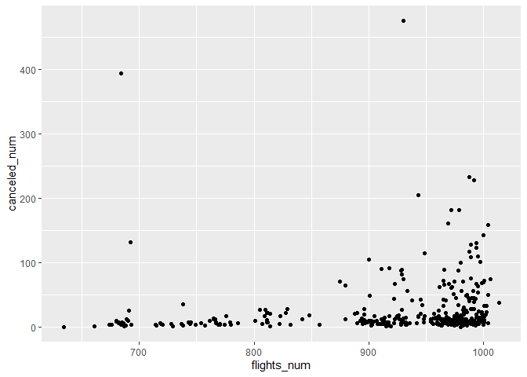
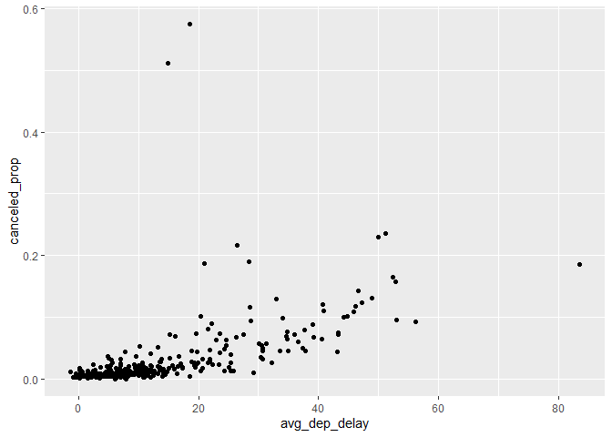

HW\_week3
================
SHUYUAN JIA
9/26/2021

## GitHub URL

*<https://github.com/Shuyuan301/STAT433_Fall2021.git>*

``` r
library(dplyr)
```

    ## Warning: package 'dplyr' was built under R version 4.0.5

    ## 
    ## Attaching package: 'dplyr'

    ## The following objects are masked from 'package:stats':
    ## 
    ##     filter, lag

    ## The following objects are masked from 'package:base':
    ## 
    ##     intersect, setdiff, setequal, union

``` r
# install.packages("nycflights13")
library(nycflights13)
```

    ## Warning: package 'nycflights13' was built under R version 4.0.5

``` r
library(ggplot2)
```

    ## Warning: package 'ggplot2' was built under R version 4.0.5

## Question 1

How many flights have a missing dep\_time? What other variables are
missing? What might these rows represent?

``` r
filter(flights, is.na(dep_time))
```

    ## # A tibble: 8,255 x 19
    ##     year month   day dep_time sched_dep_time dep_delay arr_time sched_arr_time
    ##    <int> <int> <int>    <int>          <int>     <dbl>    <int>          <int>
    ##  1  2013     1     1       NA           1630        NA       NA           1815
    ##  2  2013     1     1       NA           1935        NA       NA           2240
    ##  3  2013     1     1       NA           1500        NA       NA           1825
    ##  4  2013     1     1       NA            600        NA       NA            901
    ##  5  2013     1     2       NA           1540        NA       NA           1747
    ##  6  2013     1     2       NA           1620        NA       NA           1746
    ##  7  2013     1     2       NA           1355        NA       NA           1459
    ##  8  2013     1     2       NA           1420        NA       NA           1644
    ##  9  2013     1     2       NA           1321        NA       NA           1536
    ## 10  2013     1     2       NA           1545        NA       NA           1910
    ## # ... with 8,245 more rows, and 11 more variables: arr_delay <dbl>,
    ## #   carrier <chr>, flight <int>, tailnum <chr>, origin <chr>, dest <chr>,
    ## #   air_time <dbl>, distance <dbl>, hour <dbl>, minute <dbl>, time_hour <dttm>

**Through the result above, we can see that there are 8255 flights have
a missing dep\_time. The departure delays(dep\_delay), arrival
time(arr\_time) and arrival delays(arr\_delay) are also missing for
these rows. Therefore, these rows seem to be the canceled flights.**

## Question 2

Currently dep\_time and sched\_dep\_time are convenient to look at, but
hard to compute with because they’re not really continuous numbers.
Convert them to a more convenient representation of number of minutes
since midnight.

**Convert dep\_time and sched\_dep\_time**

``` r
dep_time_hours = ((flights$dep_time)%/% 100)
dep_time_mins = ((dep_time_hours*60) + ((flights$dep_time)%% 100))%% 1440
#dep_time_mins

sched_dep_time_hours = ((flights$sched_dep_time)%/% 100)
sched_dep_time_mins = ((sched_dep_time_hours*60) + ((flights$sched_dep_time)%% 100))%% 1440
#sched_dep_time_mins

flight_time = mutate(flights, dep_time_mins,sched_dep_time_mins)
```

**To get the departure times in the number of minutes since midnight, we
need to divide dep\_time by 100 to get the hours. Then multiply by 60
and add the remainder of dep\_time divided by 100.**

**Note: When the time is 24:00, there is 1440 minutes since midnight,
but it should be 0. We need to deal with it by using %%1440 to convert
24:00 be zero.**

**Show only relevant columns**

``` r
select(flight_time, dep_time, dep_time_mins, sched_dep_time,sched_dep_time_mins)
```

    ## # A tibble: 336,776 x 4
    ##    dep_time dep_time_mins sched_dep_time sched_dep_time_mins
    ##       <int>         <dbl>          <int>               <dbl>
    ##  1      517           317            515                 315
    ##  2      533           333            529                 329
    ##  3      542           342            540                 340
    ##  4      544           344            545                 345
    ##  5      554           354            600                 360
    ##  6      554           354            558                 358
    ##  7      555           355            600                 360
    ##  8      557           357            600                 360
    ##  9      557           357            600                 360
    ## 10      558           358            600                 360
    ## # ... with 336,766 more rows

## Question 3

Look at the number of canceled flights per day. Is there a pattern? Is
the proportion of canceled flights related to the average delay? Use
multiple dyplr operations, all on one line, concluding with
ggplot(aes(x= ,y=)) + geom\_point()

**Firstly, we are trying to figure out whether there is a pattern for
canceled flights or not.**

``` r
mutate(flights,cancel = (is.na(arr_delay) | is.na(dep_delay))) %>%
  group_by(year, month, day) %>%
  summarise(canceled_num = sum(cancel),
    flights_num = n()) %>% 
  ggplot(aes(x = flights_num, y = canceled_num)) + geom_point()
```

    ## `summarise()` has grouped output by 'year', 'month'. You can override using the `.groups` argument.

<!-- -->

**Through the plot above (flights\_num against canceled\_num), we can
see that the number of flights canceled increases with the total number
of flights.**

**Next, try to figure out whether there is a relationship between the
proportion of flights canceled and the average departure delay.**

``` r
mutate(flights, cancel=is.na(arr_delay) | is.na(dep_delay)) %>% 
  group_by(year,month,day) %>% 
  summarise(canceled_prop = mean(cancel),
            avg_dep_delay = mean(dep_delay, na.rm = TRUE)) %>% 
  ggplot(aes(x = avg_dep_delay, y = canceled_prop)) + geom_point() 
```

    ## `summarise()` has grouped output by 'year', 'month'. You can override using the `.groups` argument.

<!-- -->

**Through the plot above, we can see clearly that there is a strong
increasing relationship between the proportion of flights canceled and
the average departure delay.**
