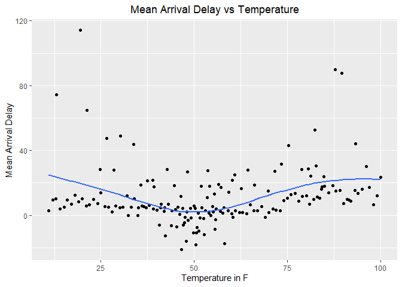
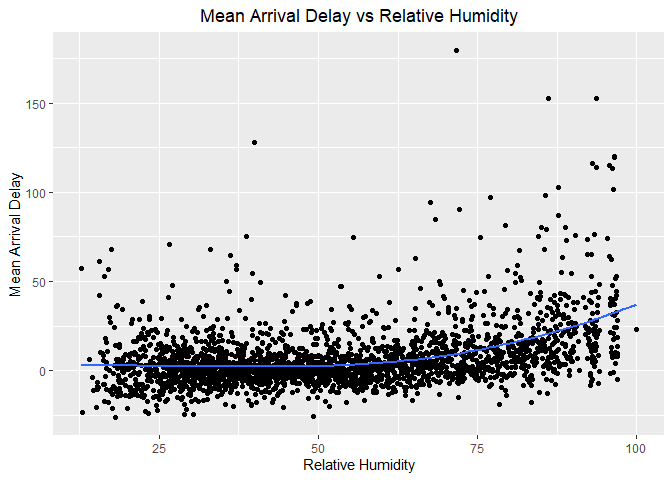
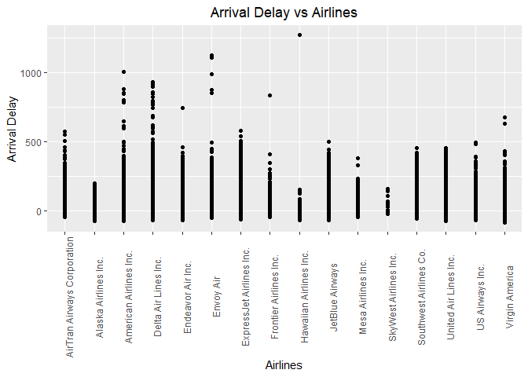

HW\_week4
================
SHUYUAN JIA
10/3/2021

## GitHub URL

*<https://github.com/Shuyuan301/STAT433_Fall2021.git>*

``` r
library(nycflights13)
library(tidyverse)
```

    ## -- Attaching packages --------------------------------------- tidyverse 1.3.1 --

    ## v ggplot2 3.3.5     v purrr   0.3.4
    ## v tibble  3.1.4     v dplyr   1.0.7
    ## v tidyr   1.1.3     v stringr 1.4.0
    ## v readr   2.0.2     v forcats 0.5.1

    ## -- Conflicts ------------------------------------------ tidyverse_conflicts() --
    ## x dplyr::filter() masks stats::filter()
    ## x dplyr::lag()    masks stats::lag()

## Introduction

We know that there are many factors may affect the delays of flights. In
this assignment, I will mainly focus on *Time of Flight*, *weather*
(including temperature, humidity, and visibility), *Airlines* and
*Airport* factors.

The following are some patterns I found:

1.  Morning flights have less delays than evening flights. (Time of
    Flight as a factor)

2.  Arrival delays of flights are closely related to the weather
    conditions. Extreme temperatures will cause more delays. As relative
    humidity increases, there is a slight increase for arrival delays.
    As the visibility improves, the times for arrival delays decrease.
    (Temperature, Humidity, and Visibility as factors)

3.  The airline for the flight is also an important factor considering
    arrival delays. Some airlines always have less delays than others,
    such as Alaska Airlines, Hawaiian Airlines; while some airlines
    usually have more delays than others. (Airlines as a factor)

## Finding 1

Firstly, I consider the question that what time of day can avoid delays
as much as possible. I group by the hour of the flight, and compute the
mean value of arrival delays. Then arrange the mean arrival delays
ascending.

``` r
mean_delay_time = flights %>% 
  group_by(hour) %>% 
  summarise(mean_arr_delay = mean(arr_delay, na.rm = TRUE)) %>% 
  drop_na() %>% 
  arrange(mean_arr_delay)

mean_delay_time
```

    ## # A tibble: 19 x 2
    ##     hour mean_arr_delay
    ##    <dbl>          <dbl>
    ##  1     7         -5.30 
    ##  2     5         -4.80 
    ##  3     6         -3.38 
    ##  4     9         -1.45 
    ##  5     8         -1.11 
    ##  6    10          0.954
    ##  7    11          1.48 
    ##  8    12          3.49 
    ##  9    13          6.54 
    ## 10    14          9.20 
    ## 11    23         11.8  
    ## 12    15         12.3  
    ## 13    16         12.6  
    ## 14    18         14.8  
    ## 15    22         16.0  
    ## 16    17         16.0  
    ## 17    19         16.7  
    ## 18    20         16.7  
    ## 19    21         18.4

Through the results above, we can see that morning flights(from 5-9)
have less delays, while the evening flights seem have more delays.
Therefore, the earlier the flight is scheduled, then the lower its
expected delay. Since the delays will affect later flights, and morning
flights have fewer previous flights.

To make my finding more clear and powerful, I plot the mean arrival
delay vs the time of flight below.

``` r
ggplot(mean_delay_time,aes(x = hour, y =mean_arr_delay)) +
  geom_line()+
  scale_x_continuous(labels = as.character(mean_delay_time$hour),
                     breaks = mean_delay_time$hour) +
  labs(x = "Time of Flight", y = "Mean Arrial Delay",
       title = "Mean Arrival Delay vs Time of Flight") +
  theme(plot.title = element_text(hjust = 0.5))
```

<!-- -->

From this plot, we can see clearly that the best flight time to avoid
delays is morning.

### Finding 2:

There is a common sense that weather conditions are easily affect the
status of flights. Therefore, I am going to figure out how these weather
factors affect the flight delays. I choose to use temperature, humidity,
and visibility as factors and see how they play a big role in this case.

In order to do so, I also use the relative data which is *weather*, and
then combine them together.

``` r
newdf = flights %>%
  select(-year, -month,-day, -hour) %>% 
  left_join(weather, by = c("origin", "time_hour"))
```

After that, I group by temperature, and compute the mean value of
arrival delays. Then arrange the mean arrival delays descending.

``` r
temp_df = newdf %>% 
  group_by(temp) %>% 
  summarise(arr_delay_mean = mean(arr_delay, na.rm = TRUE)) %>% 
  drop_na() %>% 
  arrange(desc(arr_delay_mean))

temp_df
```

    ## # A tibble: 168 x 2
    ##     temp arr_delay_mean
    ##    <dbl>          <dbl>
    ##  1  19.4          114. 
    ##  2  87.8           89.9
    ##  3  89.6           87.8
    ##  4  13.1           74.3
    ##  5  21.2           64.8
    ##  6  82.4           52.7
    ##  7  30.2           48.9
    ##  8  26.6           47.3
    ##  9  93.2           44.3
    ## 10  33.8           43.7
    ## # ... with 158 more rows

Through the result above, we may have a basic idea of how temperature
affects the delays of flights. Let’s look at the plot to get more direct
conclusion.

``` r
ggplot(temp_df,aes(x = temp, y = arr_delay_mean))+ geom_point() +
  geom_smooth(method = 'loess',se = FALSE, formula = 'y~x')+
  labs(x = "Temperature in F",
       y = "Mean Arrival Delay",
       title = "Mean Arrival Delay vs Temperature")+
  theme(plot.title = element_text(hjust = 0.5))
```

<!-- -->

Through the plot, we can see clearly that at extreme temperatures, there
are more delays.

Next, let’s see how humidity affects the delays. Group by humidity, and
compute the mean value of arrival delays. Then arrange the mean arrival
delays descending.

``` r
humid_df = newdf %>% 
  group_by(humid) %>% 
  summarise(arr_delay_mean = mean(arr_delay, na.rm = TRUE)) %>% 
  drop_na() %>% 
  arrange(desc(arr_delay_mean))

humid_df
```

    ## # A tibble: 2,440 x 2
    ##    humid arr_delay_mean
    ##    <dbl>          <dbl>
    ##  1  71.6           179.
    ##  2  93.6           153.
    ##  3  86.1           152.
    ##  4  40.0           128.
    ##  5  96.4           120 
    ##  6  96.5           120.
    ##  7  93.0           116.
    ##  8  95.7           115.
    ##  9  93.6           114.
    ## 10  96.1           113.
    ## # ... with 2,430 more rows

``` r
ggplot(humid_df,aes(x = humid, y = arr_delay_mean))+ geom_point() +
  geom_smooth(method = 'loess',se = FALSE, formula = 'y~x')+
  labs(x = "Relative Humidity",
       y = "Mean Arrival Delay",
       title = "Mean Arrival Delay vs Relative Humidity")+
  theme(plot.title = element_text(hjust = 0.5))
```

<!-- -->

We can see that there is a slight increase trend for arrival delays as
the relative humidity increases.

Last, let’s see how visibility affects the delays. Similarly, group by
visibility, and compute the mean value of arrival delays. Then arrange
the mean arrival delays.

``` r
visib_df = newdf %>% 
  group_by(visib) %>% 
  summarise(arr_delay_mean = mean(arr_delay, na.rm = TRUE)) %>% 
  drop_na() %>% 
  arrange(arr_delay_mean)

visib_df
```

    ## # A tibble: 20 x 2
    ##    visib arr_delay_mean
    ##    <dbl>          <dbl>
    ##  1 10              4.32
    ##  2  9             15.6 
    ##  3  8             16.0 
    ##  4  7             16.3 
    ##  5  6             17.1 
    ##  6  4             17.7 
    ##  7  5             18.9 
    ##  8  0.25          20.8 
    ##  9  3             21.7 
    ## 10  2.5           21.7 
    ## 11  0             24.9 
    ## 12  2             26.3 
    ## 13  0.06          28.5 
    ## 14  1.5           34.7 
    ## 15  1             37.6 
    ## 16  0.5           39.8 
    ## 17  0.75          41.4 
    ## 18  0.12          45.4 
    ## 19  1.75          45.6 
    ## 20  1.25          65.1

``` r
ggplot(visib_df,aes(x = visib, y = arr_delay_mean))+ geom_point() +
  geom_smooth(method = 'loess',se = FALSE, formula = 'y~x')+
  labs(x = "Visibility in Miles",
       y = "Mean Arrival Delay",
       title = "Mean Arrival Delay vs Visibility")+
  theme(plot.title = element_text(hjust = 0.5))
```

<!-- -->

We can see that as the visibility improves, the delay curve goes down
which means the mean arrival delays decrease.

### Finding 3:

After thinking about weather, I am wondering is it possible that the
airlines and airports also affect the delays of flights. Firstly, I try
to explore the pattern between Arrival Delay and Airlines.

Here, we need to use relative data *airlines*, and then combine it with
flights data.

``` r
airline_delay <- flights %>%
  left_join(airlines,by="carrier") %>%
  group_by(name) %>%
  summarise(arr_delay_mean = mean(arr_delay,na.rm = TRUE)) %>% 
  drop_na() %>% 
  arrange(arr_delay_mean)

airline_delay
```

    ## # A tibble: 16 x 2
    ##    name                        arr_delay_mean
    ##    <chr>                                <dbl>
    ##  1 Alaska Airlines Inc.                -9.93 
    ##  2 Hawaiian Airlines Inc.              -6.92 
    ##  3 American Airlines Inc.               0.364
    ##  4 Delta Air Lines Inc.                 1.64 
    ##  5 Virgin America                       1.76 
    ##  6 US Airways Inc.                      2.13 
    ##  7 United Air Lines Inc.                3.56 
    ##  8 Endeavor Air Inc.                    7.38 
    ##  9 JetBlue Airways                      9.46 
    ## 10 Southwest Airlines Co.               9.65 
    ## 11 Envoy Air                           10.8  
    ## 12 SkyWest Airlines Inc.               11.9  
    ## 13 Mesa Airlines Inc.                  15.6  
    ## 14 ExpressJet Airlines Inc.            15.8  
    ## 15 AirTran Airways Corporation         20.1  
    ## 16 Frontier Airlines Inc.              21.9

Through the result above, we can see that some airlines have less delays
than some other airlines. Let’s use plot to check.

``` r
new = left_join(airlines,flights,by="carrier")
new %>% 
  drop_na() %>% 
  ggplot(aes(x = name, y = arr_delay))+ geom_point() +
  theme(axis.text.x = element_text(angle = 90))+ 
  labs(x = "Airlines",
       y = "Arrival Delay",
       title = "Arrival Delay vs Airlines")+
  theme(plot.title = element_text(hjust = 0.5))
```

<!-- -->

Instead of using mean value, I use arrival delays directly since the
average value may be affected by some extreme values. (I am sorry that
it could run a little bit slow.) We can see that SkyWest Airlines,
Hawaiian Airlines and Alaska Airlines are some airlines that have less
delays.

Then I try to figure out if there is a pattern between Arrival Delay and
Origin.

``` r
origin_delay <- flights %>%
  left_join(airlines,by="carrier") %>%
  group_by(origin) %>%
  summarise(arr_delay_mean = mean(arr_delay,na.rm = TRUE)) %>% 
  drop_na() %>% 
  arrange(desc(arr_delay_mean))

origin_delay
```

    ## # A tibble: 3 x 2
    ##   origin arr_delay_mean
    ##   <chr>           <dbl>
    ## 1 EWR              9.11
    ## 2 LGA              5.78
    ## 3 JFK              5.55

Here, I compute the mean arrival delays for each origin. Through this
result, we can say there is relatively high probability to have delays
at EWR. Also, use the plot to check.

``` r
flights %>% 
  drop_na() %>% 
  ggplot(aes(x = origin, y = arr_delay))+ geom_point() +
  labs(x = "Origin",
       y = "Arrival Delay",
       title = "Arrival Delay vs Origin")+
  theme(plot.title = element_text(hjust = 0.5))
```

<!-- -->

Through the plot above, we can not see the differences between EWR and
LGA clearly. Therefore, we can not conclude that the origin is a strong
factor to affect the delays for flights. So, I did not put this into my
findings part at the very beginning of this assignment.
